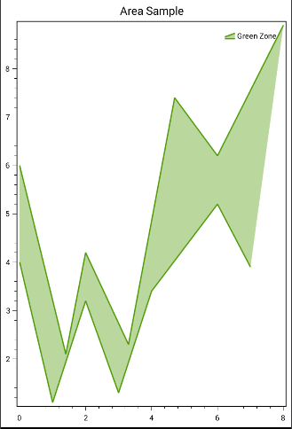

==========
AreaSeries
==========

.. note:: This section is under construction. Please contribute!

A ``AreaSeries`` shows an area between two sets of points, or between a
set of point and a baseline.

.. image:: AreaSeries.png

Tracker
-------

The ``TrackerFormatString`` property is used to format the string shown
in the `tracker`_. The format string may use the following arguments:

-  ``{0}`` the title of the series
-  ``{1}`` the title of the x-axis
-  ``{2}`` the x-value
-  ``{3}`` the title of the y-axis
-  ``{4}`` the y-value
-  ``{PropertyX}`` the value of ``PropertyX`` in the item (extended
   format string syntax)

To show the x and y values with one digit, use the format string
``"{2:0.0},{4:0.0}"``.

If an item was hit, it is also possible to use the extended format
string syntax, e.g. ``{PropertyX:0.##}``, where the value of
``PropertyX`` will be found by reflection of the item.

The default format string for ``AreaSeries`` is
``"{0}\n{1}: {2}\n{3}: {4}"``

See `MSDN`_ for more information about format strings.

The ``TrackerKey`` property may be used to specify a `custom tracker`_.
This makes it possible to use different trackers for each series.

Example
-------

.. sourcecode:: csharp

      PlotModel model = new PlotModel { Title = "Area Sample" };

      var series1 = new AreaSeries { Title = "Green Zone" };

      //high boundary
      series1.Points.Add(new DataPoint(0.0, 6.0));
      series1.Points.Add(new DataPoint(1.4, 2.1));
      series1.Points.Add(new DataPoint(2.0, 4.2));
      series1.Points.Add(new DataPoint(3.3, 2.3));
      series1.Points.Add(new DataPoint(4.7, 7.4));
      series1.Points.Add(new DataPoint(6.0, 6.2));
      series1.Points.Add(new DataPoint(8.0, 8.9));

      //low boundary
      series1.Points2.Add(new DataPoint(0.0, 4.0));
      series1.Points2.Add(new DataPoint(1.0, 1.1));
      series1.Points2.Add(new DataPoint(2.0, 3.2));
      series1.Points2.Add(new DataPoint(3.0, 1.3));
      series1.Points2.Add(new DataPoint(4.0, 3.4));
      series1.Points2.Add(new DataPoint(6.0, 5.2));
      series1.Points2.Add(new DataPoint(7.0, 3.9));

      model.Series.Add(series1);

.. _tracker: ../tracker
.. _MSDN: http://msdn.microsoft.com/en-us/library/system.string.format(v=vs.110).aspx
.. _custom tracker: ../tracker
